# Ram's Gym

**A strength-training diary for Android that plans your progress from what you actually lifted.**

Log every set, run load cycles, see your records and get honest numbers about your training — offline, on your phone. Friends, a shared feed, likes and comments are there when you want them.

  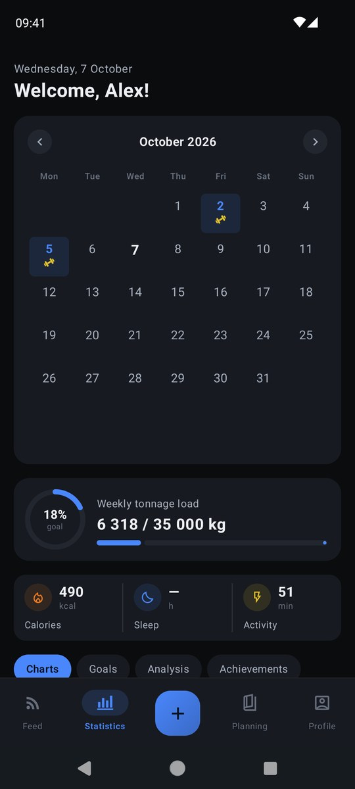
  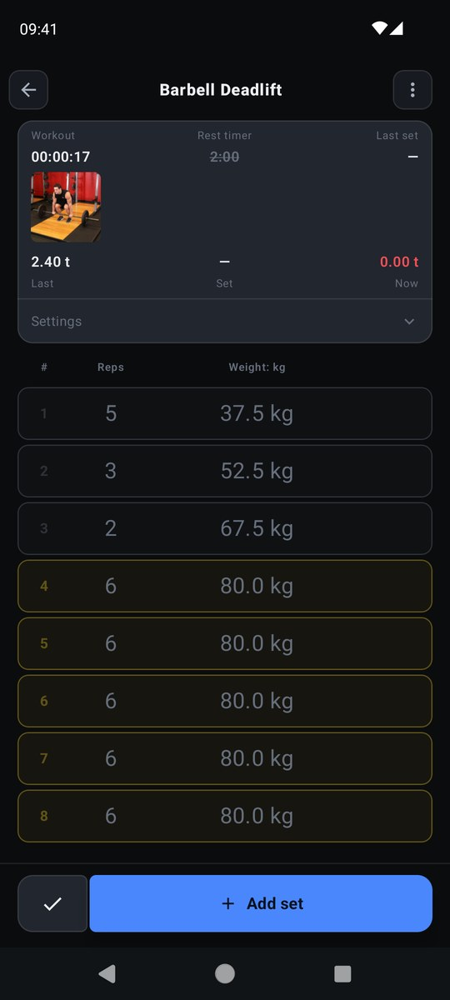
  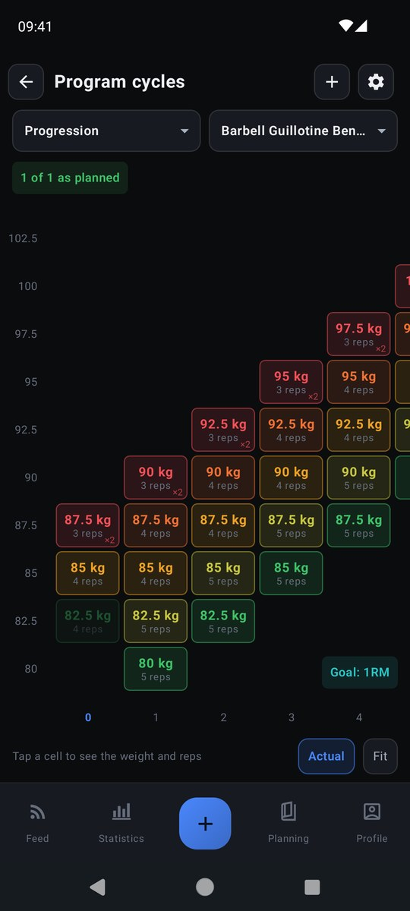
  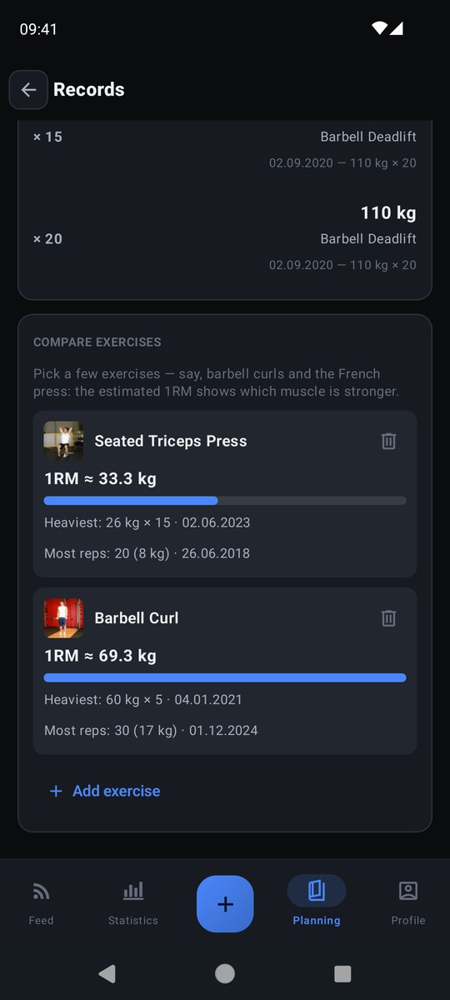

  <a href="https://github.com/Ramzesp2009/ramsgym-realses/releases/latest"><b>⬇ Download the latest APK</b></a>
  &nbsp;·&nbsp; Android 10 or newer &nbsp;·&nbsp; English and Ukrainian

---

## Contents

- [What makes it different](#what-makes-it-different)
- [Statistics](#statistics)
- [The workout](#the-workout)
- [Workout summary and history](#workout-summary-and-history)
- [Planning](#planning)
- [Load cycles (periodization)](#load-cycles-periodization)
- [Analysis](#analysis)
- [Records](#records)
- [Feed and friends](#feed-and-friends)
- [Profile and settings](#profile-and-settings)
- [Install and update](#install-and-update)
- [Privacy](#privacy)
- [License](#license)

---

## What makes it different

- **Offline first.** Every workout, program and cycle lives in a local database on your phone. No account is needed to train; the account only adds friends and the feed.
- **The plan follows the lifter, not the lifter the plan.** A load cycle reads where you stand from the weights you actually lifted — go heavier than planned and the plan moves forward with you; miss twice and it offers a light day instead of more weight.
- **Numbers you can trust.** 1RM is estimated only up to 10 reps (Brzycki) — above that the app says there is no value rather than invent one. Tonnage means *working* tonnage: warm-up sets are counted separately.
- **It explains, it does not decide.** Rest times, warm-up ramps, weekly volume — every rule the app uses is written down in *Guides* with its sources and what happens if you change it. Recommendations are text; nothing changes without you.
- **A tip a day.** 100 short tips on training, nutrition, mobility, recovery and cycles — a new one each day under every finished workout and on the Planning screen.

---

## Statistics

The start screen. A calendar of your training on top, then the weekly tonnage goal and four tabs underneath.

<table>
  <tr>
    <td width="33%"></td>
    <td width="33%">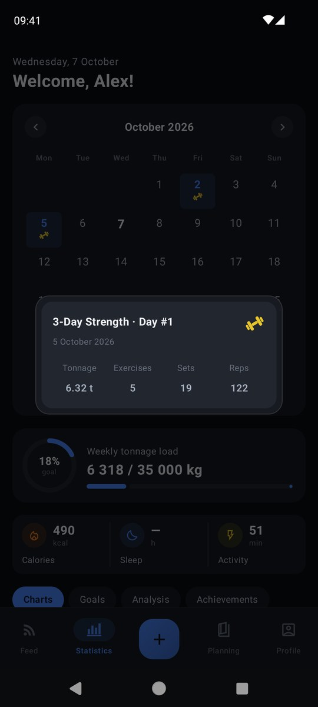</td>
    <td width="33%">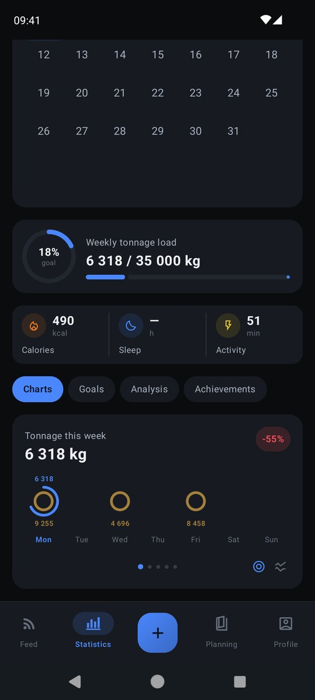</td>
  </tr>
  <tr>
    <td><b>Calendar and weekly goal.</b> Each training day carries a dumbbell coloured by how hard the workout was — the share of hard working sets, not an average.</td>
    <td><b>A day in the calendar.</b> Tap a day to see its workouts: tonnage, exercises, sets and reps. Tap the card to open the full summary.</td>
    <td><b>Rings by day.</b> Each weekday is a pair of rings — last week inside, this week outside. The larger of the two closes its ring, so you compare a day with itself.</td>
  </tr>
  <tr>
    <td>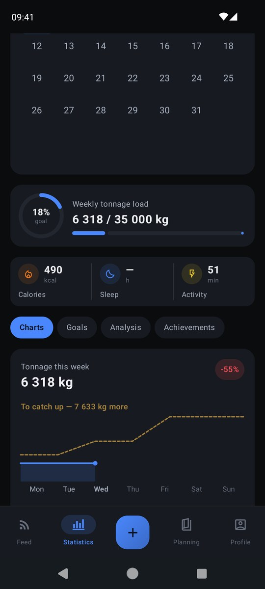</td>
    <td>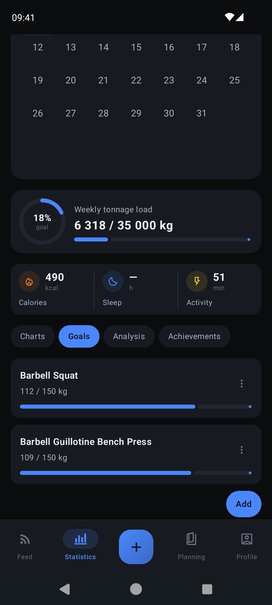</td>
    <td>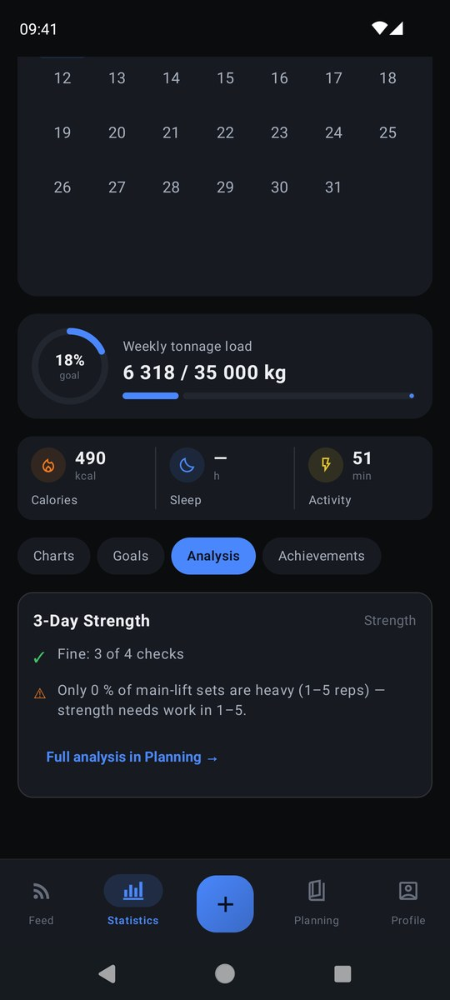</td>
  </tr>
  <tr>
    <td><b>Race against last week.</b> Running totals from Monday: last week dashed across all seven days, this week solid up to today, and the gap said in words. Honest even when your training days move around.</td>
    <td><b>Goals.</b> A goal is either a 1RM (“150 kg max”) or weight for reps (“100 kg × 10”). Tap a goal to open the workout where its current best was set.</td>
    <td><b>Analysis at a glance.</b> A short summary of the program check; the full report lives in Planning.</td>
  </tr>
  <tr>
    <td>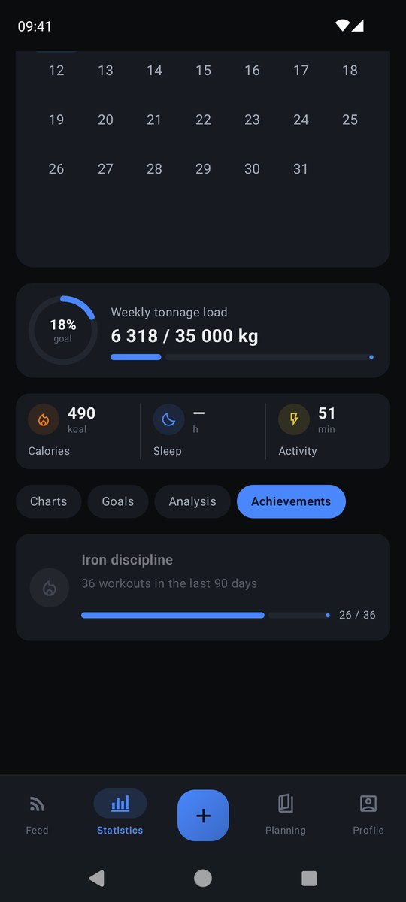</td>
    <td>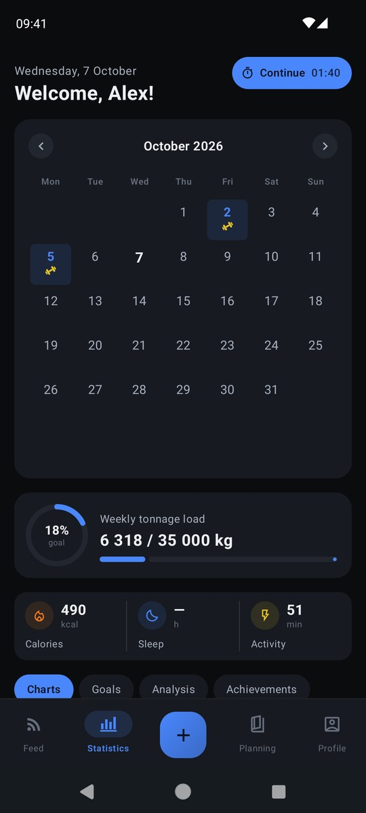</td>
    <td></td>
  </tr>
  <tr>
    <td><b>Achievements</b> with their progress bars.</td>
    <td><b>Continue.</b> While a workout is running, a pill with its timer sits in the corner of every tab and brings you back exactly where you stopped.</td>
    <td></td>
  </tr>
</table>

---

## The workout

<table>
  <tr>
    <td width="33%">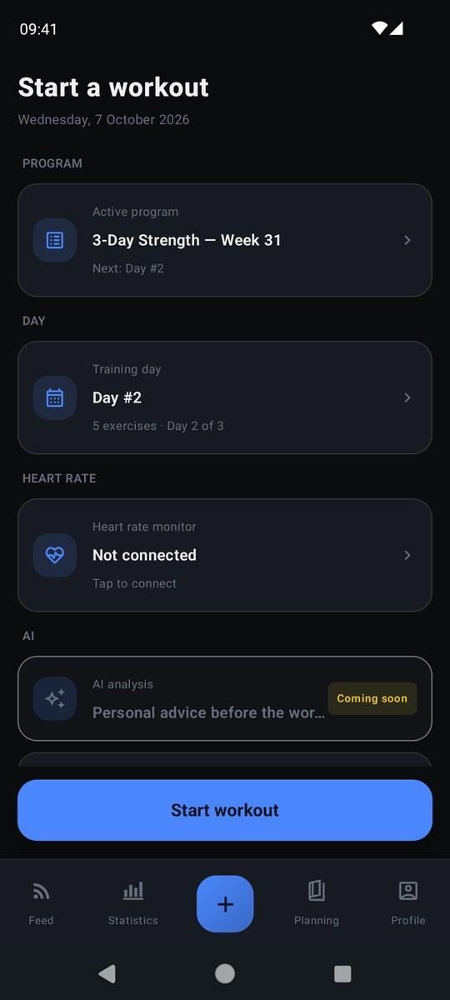</td>
    <td width="33%">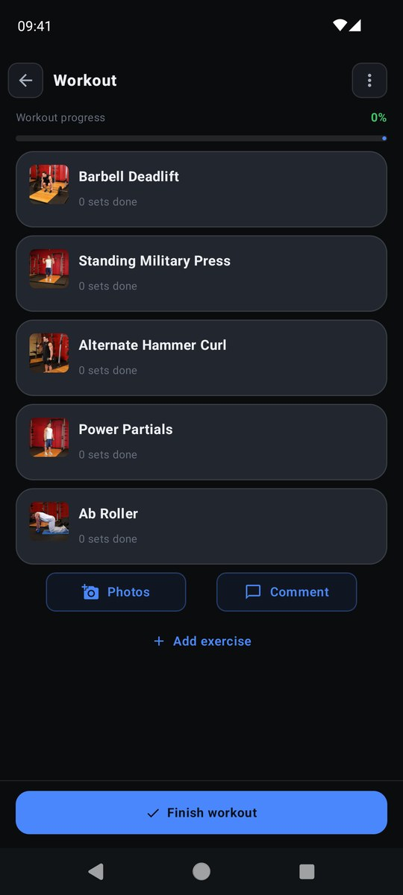</td>
    <td width="33%"></td>
  </tr>
  <tr>
    <td><b>Start a workout.</b> The next day of your active program is picked from the last one you finished. Choose another day, connect a Bluetooth heart-rate strap, and go.</td>
    <td><b>The workout.</b> The day’s exercises, progress, photos and a comment. Supersets are grouped in one frame; any exercise can be swapped for an alternative for today only.</td>
    <td><b>An exercise.</b> The capsule on top shows the workout time, the rest timer and time since the last set; below — what you did last time, so you know what to beat.</td>
  </tr>
  <tr>
    <td>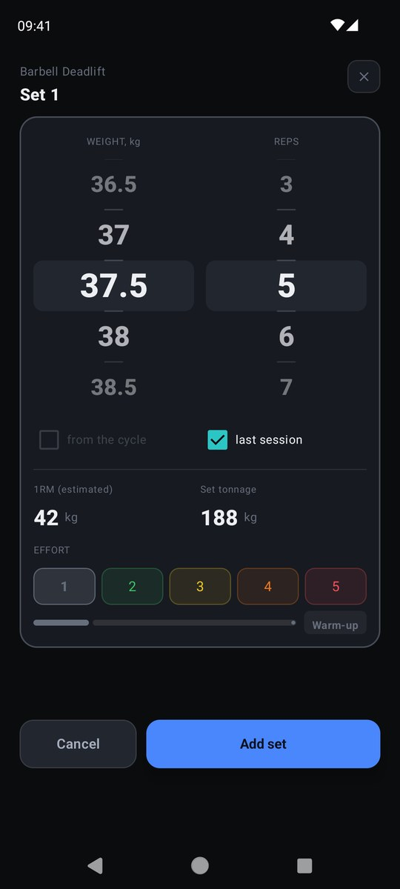</td>
    <td>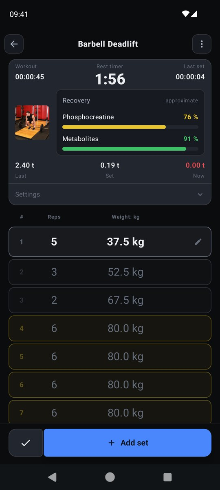</td>
    <td>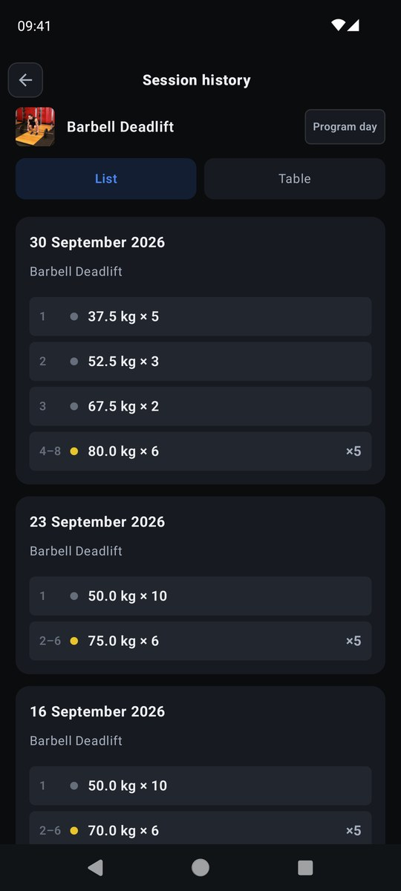</td>
  </tr>
  <tr>
    <td><b>Add a set.</b> Two wheels for weight and reps, prefilled from the cycle, from last session or from the warm-up ramp. Rate the effort 1–5 (1 is a warm-up); it drives the smart rest timer and the workout’s difficulty.</td>
    <td><b>Rest and recovery.</b> The rest timer is a real alarm — it rings with the phone in your pocket. During the rest, an approximate model shows how much phosphocreatine and how much of the metabolite load has recovered.</td>
    <td><b>Session history.</b> Every previous session of this exercise as a list or as a table, one tap away from the exercise screen.</td>
  </tr>
  <tr>
    <td>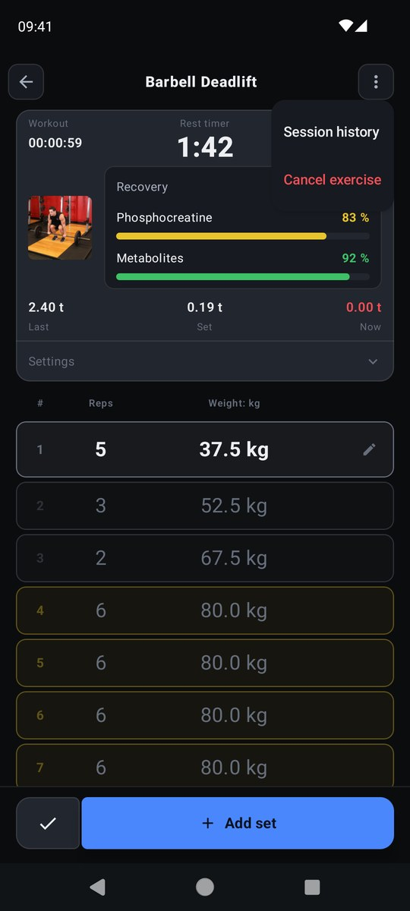</td>
    <td></td>
    <td></td>
  </tr>
  <tr>
    <td><b>Exercise menu.</b> Destructive actions live behind ⋮ and ask first — a long press never performs an action.</td>
    <td></td>
    <td></td>
  </tr>
</table>

**Smart helpers** (all optional, all switchable under *For experienced lifters*):

- **Smart rest timer** — the pause is computed from the set you just logged: 90 s after a warm-up, 2 min over 8 reps, 3 min at 5–8, 4 min at 4 or fewer; ±1 min for “hard”/“easy”. In a superset the rest starts only when the round is closed.
- **Smart warm-up** — a ramp to today’s working weight that depends on the working reps, ending with a heavy single or double for low-rep work; skipped when another exercise has already warmed the same muscle.
- **Time under load** — the time your muscles spend under the bar, from each set’s start and finish.

---

## Workout summary and history

<table>
  <tr>
    <td width="33%">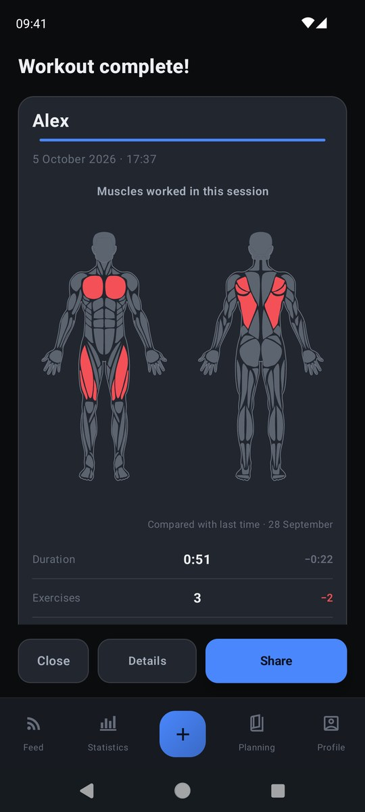</td>
    <td width="33%">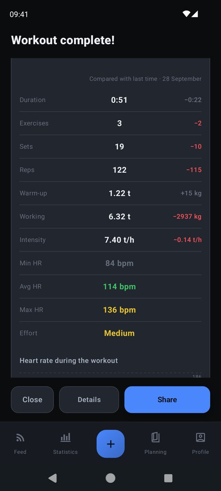</td>
    <td width="33%">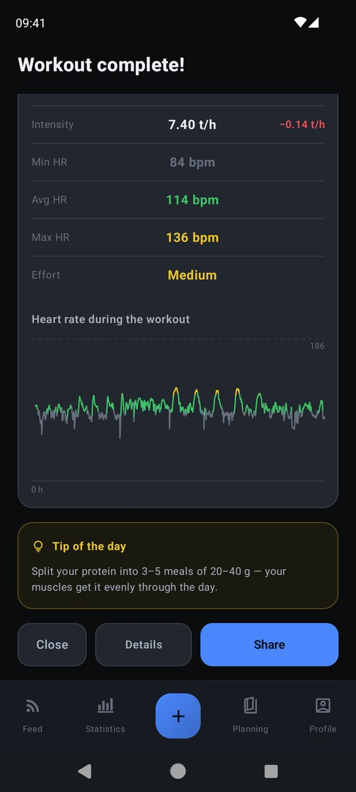</td>
  </tr>
  <tr>
    <td><b>Workout complete.</b> The muscles you trained, highlighted on a body map. The framed part can be shared as an image.</td>
    <td><b>Compared with last time.</b> Duration, exercises, sets, reps, warm-up and working tonnage, intensity and heart rate — against the previous session of the same program day, never another day.</td>
    <td><b>Heart rate and tip of the day.</b> The heart-rate curve coloured by your zones, and below the summary — the day’s tip.</td>
  </tr>
  <tr>
    <td>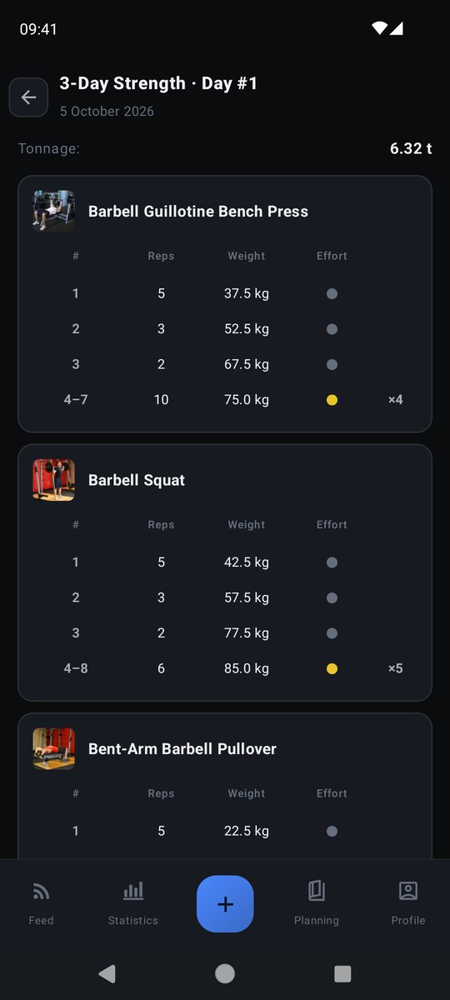</td>
    <td>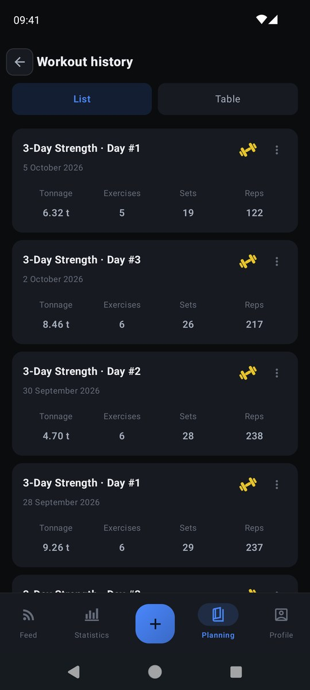</td>
    <td>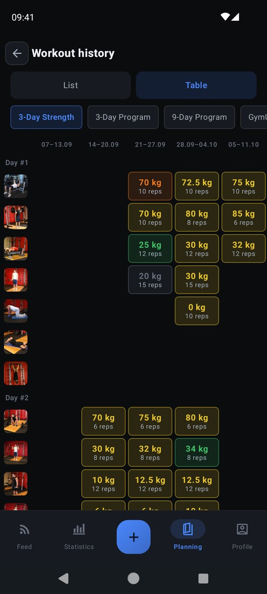</td>
  </tr>
  <tr>
    <td><b>Workout details.</b> Every set with its weight, reps and effort; repeated sets are collapsed into one line.</td>
    <td><b>Workout history</b> as a list of cards…</td>
    <td>…or as a <b>table</b>: one row per exercise, one column per week — a whole program on one screen.</td>
  </tr>
</table>

A finished workout can be reopened for 30 minutes — for the set you forgot or the “Finish” you tapped by accident.

---

## Planning

<table>
  <tr>
    <td width="33%">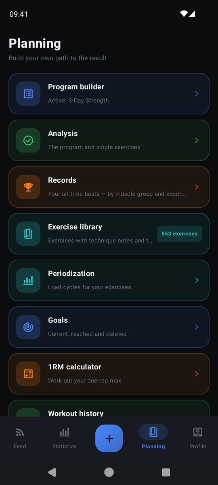</td>
    <td width="33%">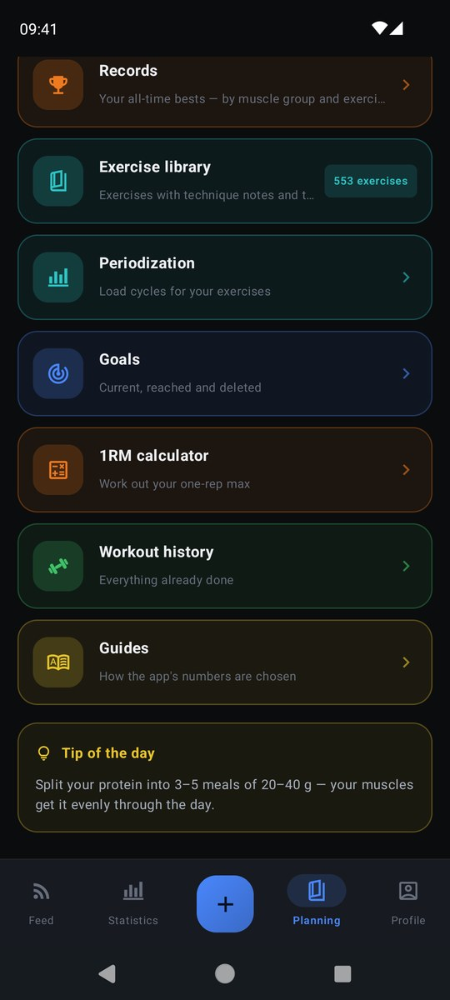</td>
    <td width="33%">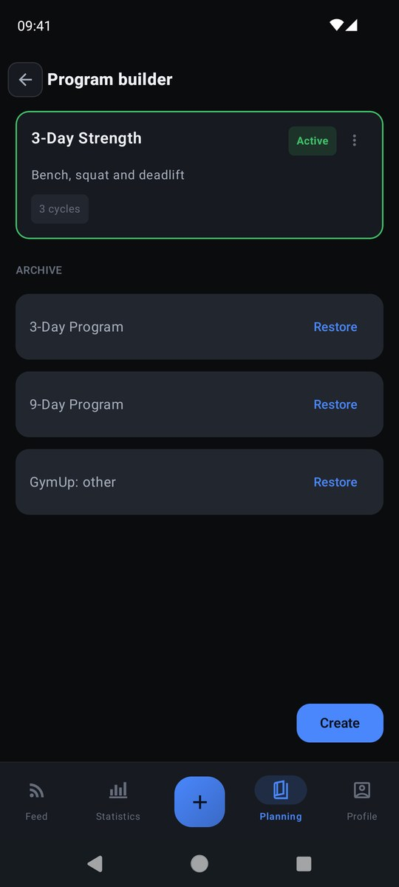</td>
  </tr>
  <tr>
    <td><b>Planning hub.</b> Programs, analysis, records, the exercise library, periodization, goals, a 1RM calculator, history and guides. Hold a tile for two seconds and drag to reorder.</td>
    <td><b>Tip of the day</b> at the bottom of the hub.</td>
    <td><b>Program builder.</b> The active program and the archive. A program with history is archived, never deleted — your workouts stay.</td>
  </tr>
  <tr>
    <td>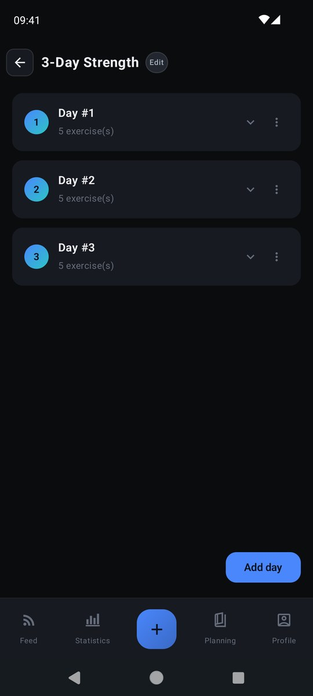</td>
    <td>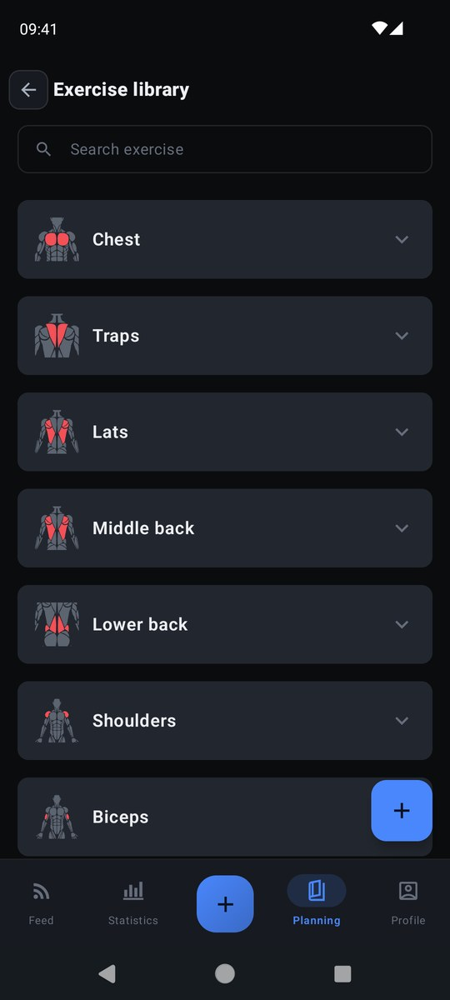</td>
    <td>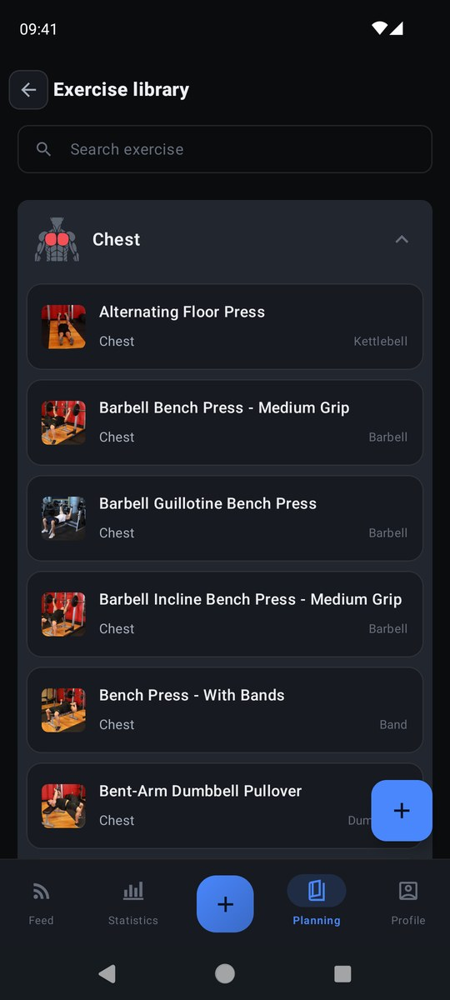</td>
  </tr>
  <tr>
    <td><b>Program days.</b> Days with their exercises, drag to reorder, supersets made by holding one exercise over another, and alternatives for each slot.</td>
    <td><b>Exercise library.</b> 549 exercises grouped by muscle, with search, plus your own exercises.</td>
    <td><b>A muscle group</b> — every exercise with a start-and-finish photo and its equipment.</td>
  </tr>
  <tr>
    <td>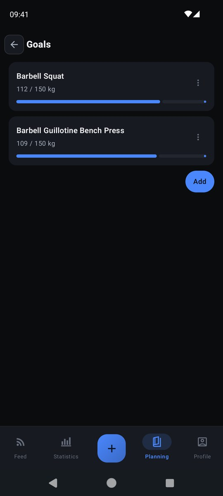</td>
    <td>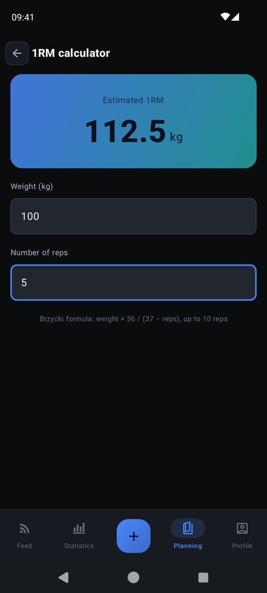</td>
    <td>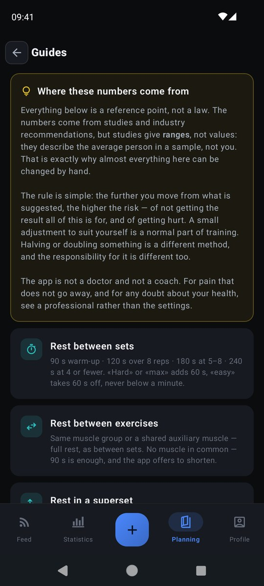</td>
  </tr>
  <tr>
    <td><b>Goals</b> — current, reached (with the date) and deleted.</td>
    <td><b>1RM calculator.</b> Brzycki, up to 10 reps — and only up to 10.</td>
    <td><b>Guides.</b> Every number the app uses — rest, warm-up, the cycle’s percentages, deloads, breaks, the 1RM ceiling, difficulty — with its sources.</td>
  </tr>
  <tr>
    <td>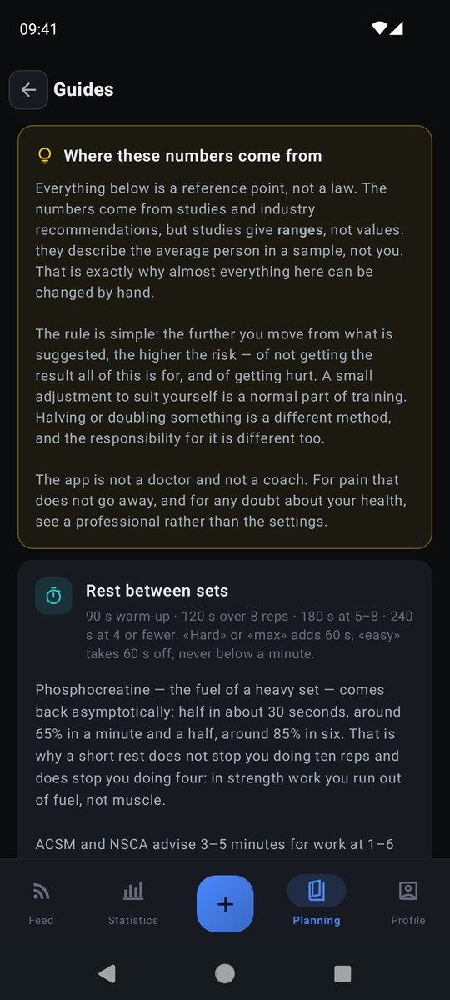</td>
    <td></td>
    <td></td>
  </tr>
  <tr>
    <td><b>A guide.</b> What the number is, why this number, what breaks if you change it, and where it comes from.</td>
    <td></td>
    <td></td>
  </tr>
</table>

---

## Load cycles (periodization)

A load cycle is one row of settings; the plan is computed from it, never stored. Its unit is the **executions of the exercise**, not weeks — how long it takes depends on how often you train.

Two models:

- **Percent of working weight** — light, medium and heavy sessions (80 / 90 / 100 % by default, editable) with a step up every few cycles at a rate computed from your training age and how far you are below your own record.
- **Wave** — the weight climbs step by step to a ceiling, takes it one to three times with more reps each time, then rolls back and starts the next wave higher. The rollback *is* the deload.

<table>
  <tr>
    <td width="33%">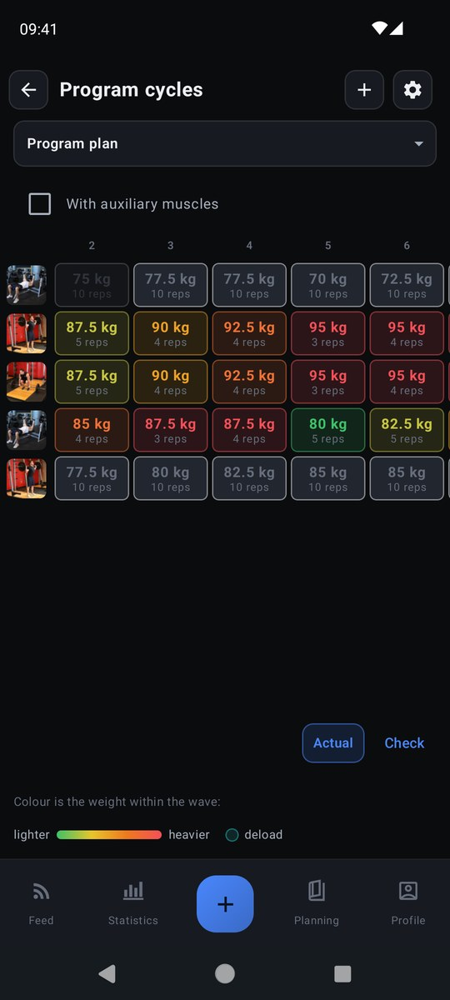</td>
    <td width="33%"></td>
    <td width="33%">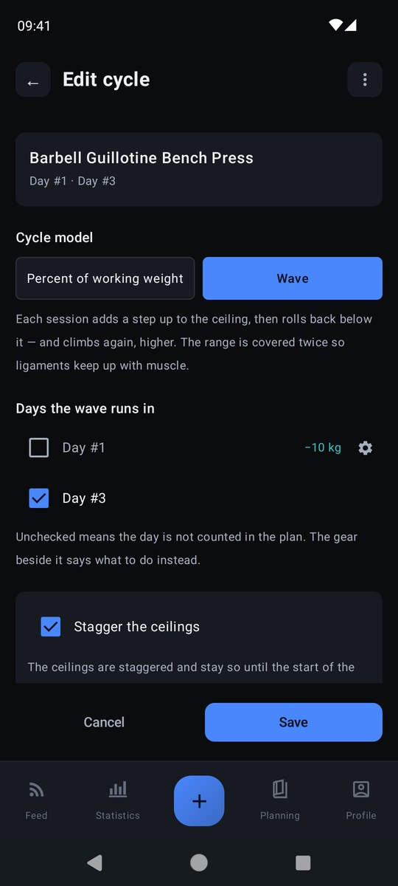</td>
  </tr>
  <tr>
    <td><b>Program plan.</b> Columns are passes through the program, rows are exercises; colour goes from light (green) to heavy (red). Switch to <i>Actual</i> to see what was really lifted, or <i>Check</i> to credit work done before the cycle.</td>
    <td><b>Progression.</b> One exercise in real kilograms: a row is a weight step, a column is a cycle — the shape of the method is visible at a glance.</td>
    <td><b>Edit cycle.</b> Model, the days the wave runs in (a day can be taken off the wave and given a lighter replacement), goal type and the start.</td>
  </tr>
  <tr>
    <td>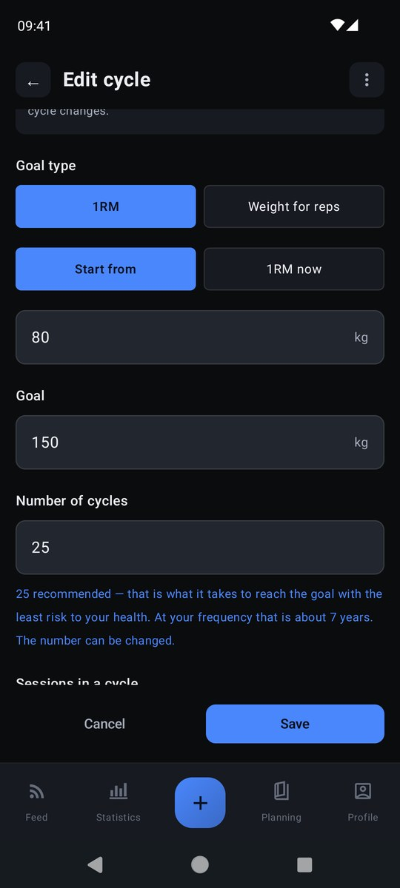</td>
    <td>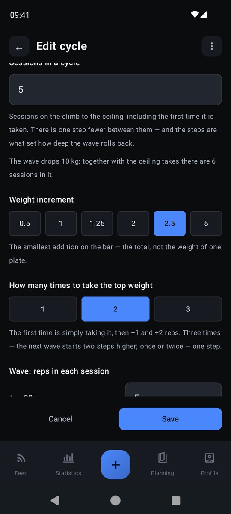</td>
    <td></td>
  </tr>
  <tr>
    <td><b>Goal and pace.</b> 1RM or weight-for-reps, a start and a target; the app recommends how many cycles that takes and roughly how long, and says so plainly.</td>
    <td><b>Wave settings.</b> Sessions on the climb, the weight increment of your bar, how many times to take the top weight, and the reps of every session.</td>
    <td></td>
  </tr>
</table>

Exercises that share muscles and a training day can run **in antiphase** so their ceilings don’t meet; ceilings of three or more cycles in one pass can be **staggered**. After a break of 2–4 weeks the card offers to restart from the lightest session of the wave; after more than four weeks it asks for a new starting weight instead of guessing.

---

## Analysis

<table>
  <tr>
    <td width="33%">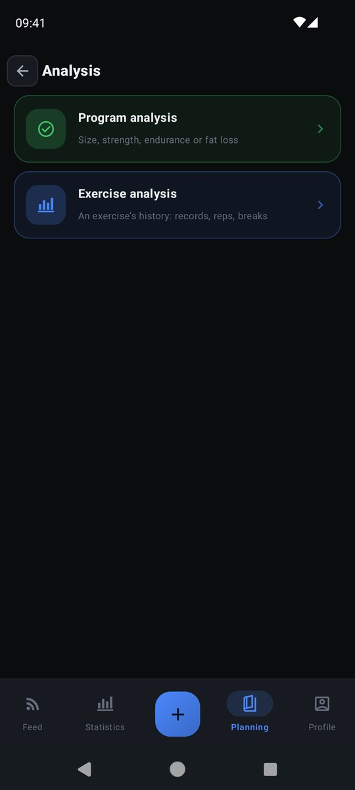</td>
    <td width="33%">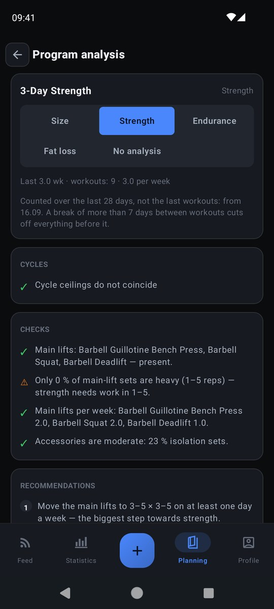</td>
    <td width="33%">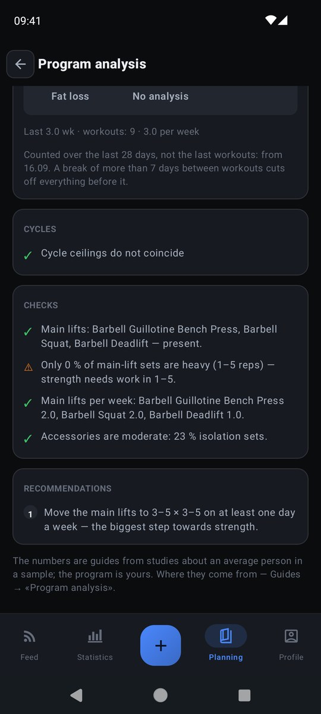</td>
  </tr>
  <tr>
    <td><b>Analysis</b> of a program or of a single exercise.</td>
    <td><b>Program analysis.</b> Pick a goal — size, strength, endurance or fat loss — and the program is checked against it using what you actually did in the last 28 days (cut at your last break), not the template.</td>
    <td><b>Checks and recommendations.</b> Weekly volume per muscle group, frequency, push : pull balance, rep ranges, the main lifts — with a recommendation for each miss.</td>
  </tr>
  <tr>
    <td>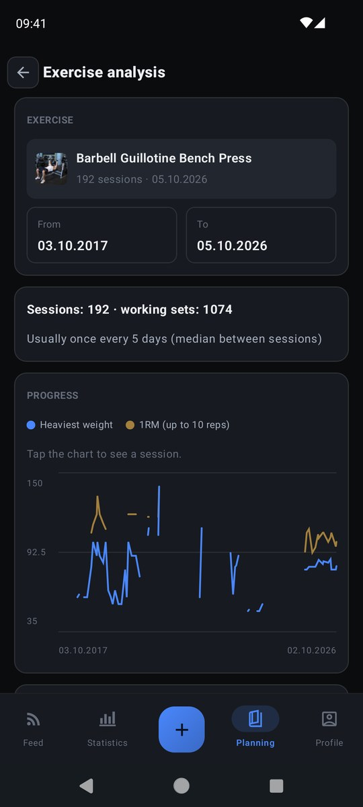</td>
    <td>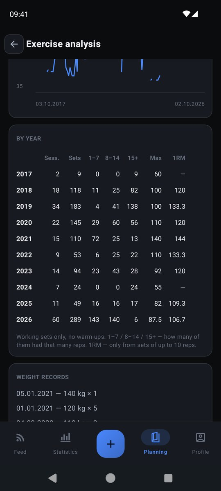</td>
    <td>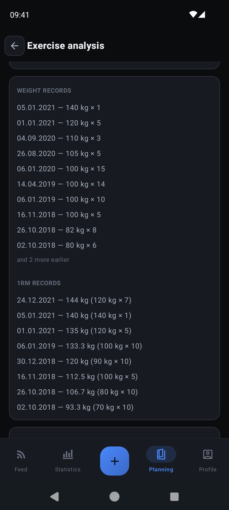</td>
  </tr>
  <tr>
    <td><b>Exercise analysis.</b> Any exercise across all programs and any date range: sessions, working sets, how often you train it, and a progress chart of the heaviest weight and the estimated 1RM.</td>
    <td><b>By year</b> — sessions, sets in each rep range, the heaviest weight and the best 1RM.</td>
    <td><b>Weight and 1RM records</b>, high-rep sets and the breaks in your history.</td>
  </tr>
</table>

---

## Records

All-time bests — over the whole history or for one muscle group. Only working sets of finished workouts count; for equal results the first one holds the record. Tap a record to open the workout where it was set.

<table>
  <tr>
    <td width="33%">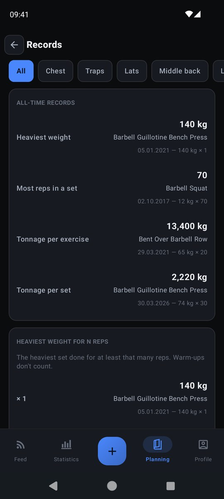</td>
    <td width="33%">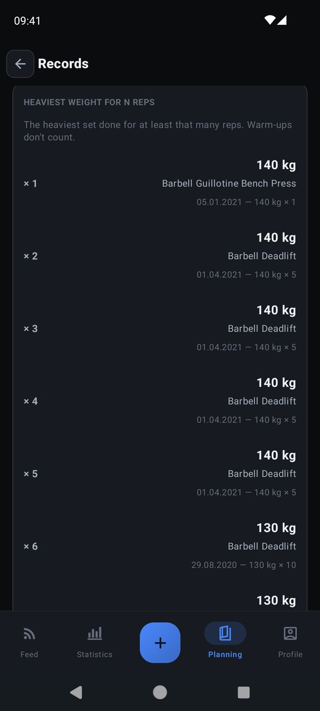</td>
    <td width="33%"></td>
  </tr>
  <tr>
    <td><b>All-time records.</b> Heaviest weight, most reps in a set, tonnage per exercise and per set — for all muscles or one group.</td>
    <td><b>Heaviest weight for N reps</b> — 1 to 10, then 15 and 20: the heaviest set done for at least that many reps.</td>
    <td><b>Compare exercises.</b> Pick any exercises — barbell curls against a triceps press, say — and the estimated 1RM bars show which muscle is stronger.</td>
  </tr>
  <tr>
    <td>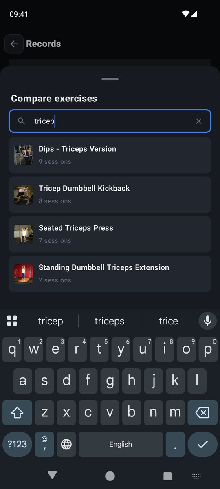</td>
    <td>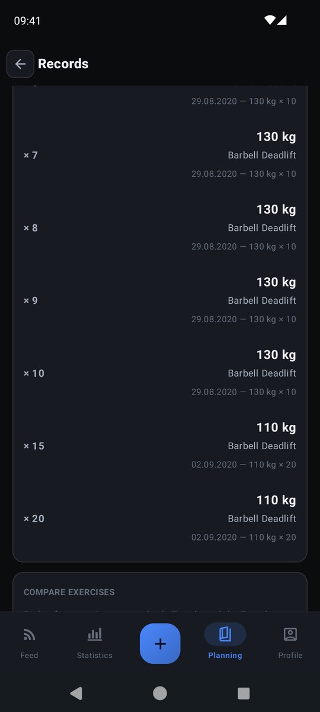</td>
    <td></td>
  </tr>
  <tr>
    <td><b>Picking exercises</b> from your history, with search.</td>
    <td>Rep maxes for the high-rep end of the table.</td>
    <td></td>
  </tr>
</table>

---

## Feed and friends

<table>
  <tr>
    <td width="33%">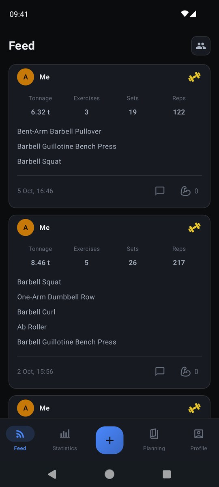</td>
    <td width="33%">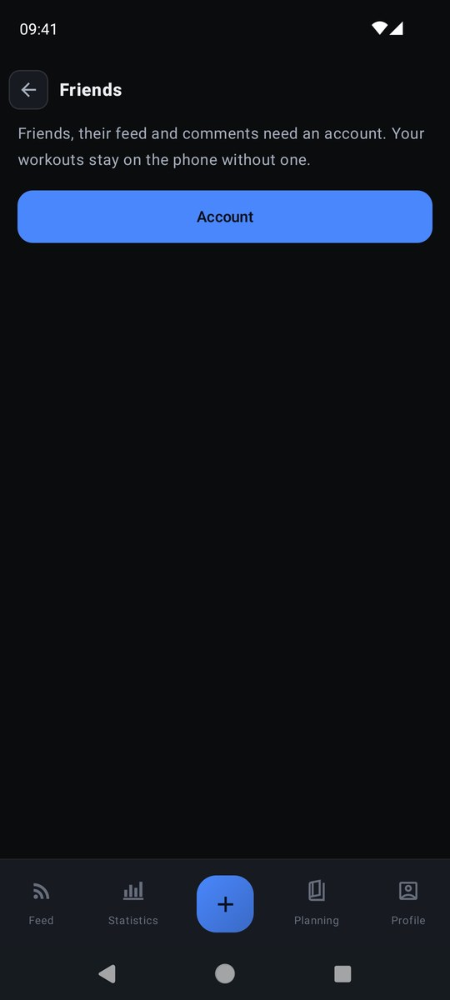</td>
    <td width="33%">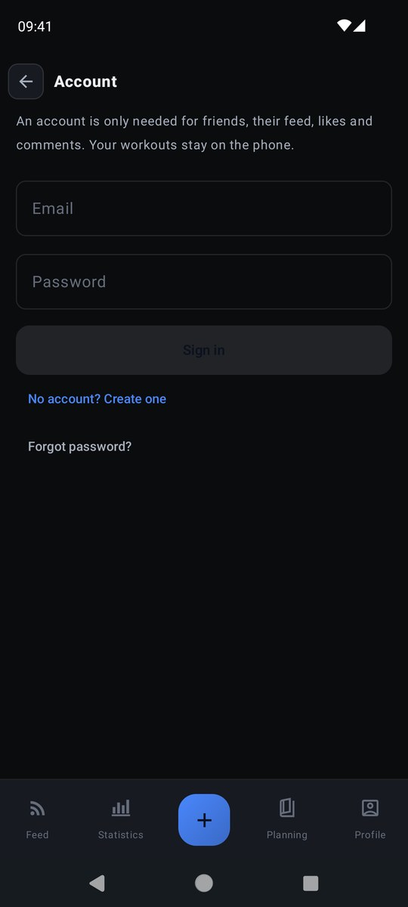</td>
  </tr>
  <tr>
    <td><b>Feed.</b> Your workouts and your friends’: tonnage, exercises, sets, reps, difficulty, photos and heart rate. Like and comment; a bell shows new workouts, likes and comments.</td>
    <td><b>Friends.</b> Friendship is mutual — find a person by name or by an 8-character friend code, shown as a QR code or sent as a link.</td>
    <td><b>Account.</b> Only needed for friends and the feed. Your workouts stay on the phone either way; signing out keeps everything.</td>
  </tr>
</table>

A published workout is a snapshot: exercises, sets, photos and heart rate — never your program, days or cycles. Publishing can be turned off.

---

## Profile and settings

<table>
  <tr>
    <td width="33%">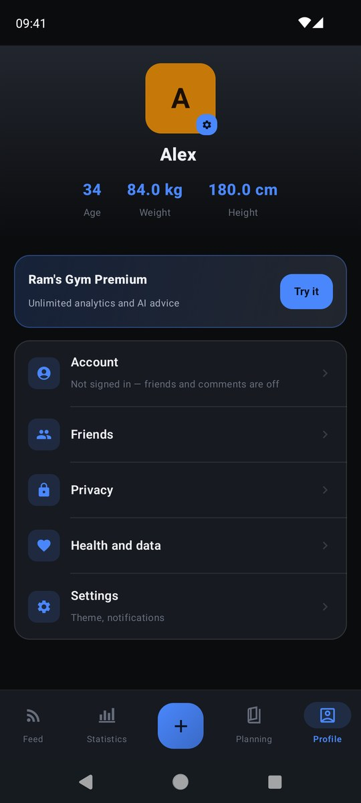</td>
    <td width="33%">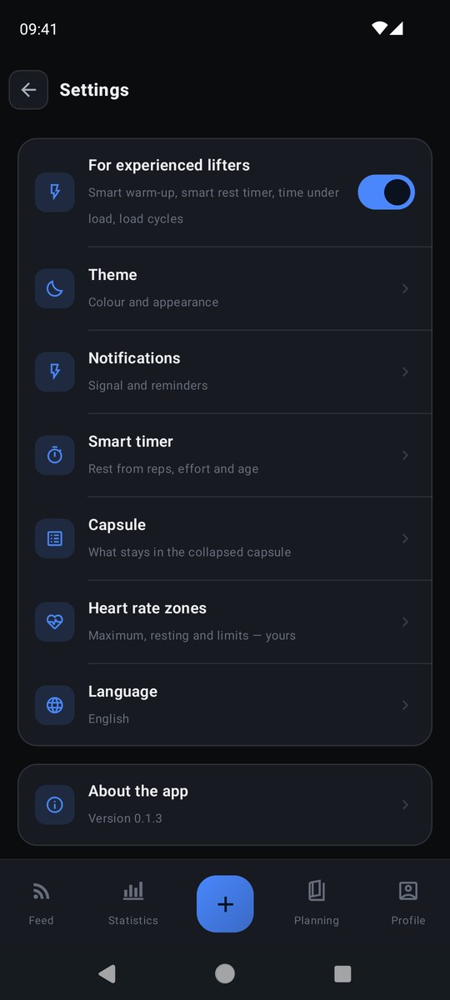</td>
    <td width="33%">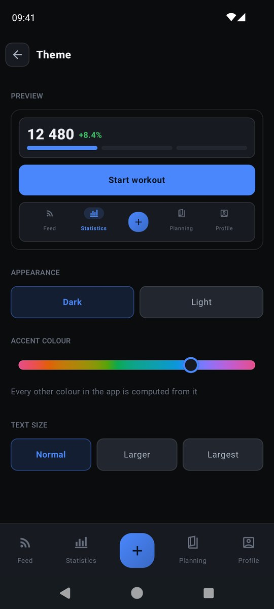</td>
  </tr>
  <tr>
    <td><b>Profile.</b> Age (from your date of birth), weight, height, account, friends, privacy, health data and settings.</td>
    <td><b>Settings.</b> One switch, <i>For experienced lifters</i>, hides and disables the smart warm-up, smart rest, time under load and load cycles — and brings them back untouched.</td>
    <td><b>Theme.</b> Dark or light, any accent colour from a slider — the whole palette is generated from one hue with readable contrast at every point.</td>
  </tr>
  <tr>
    <td>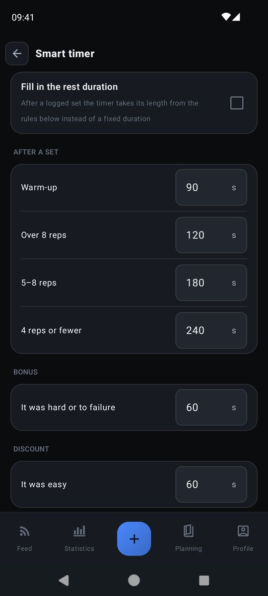</td>
    <td>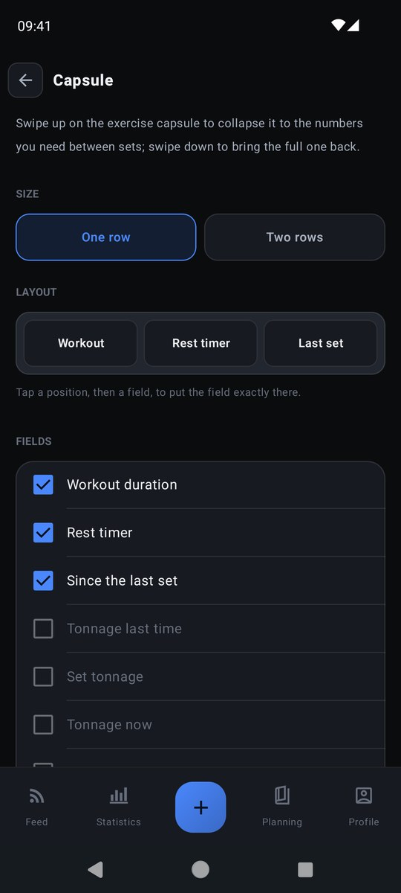</td>
    <td>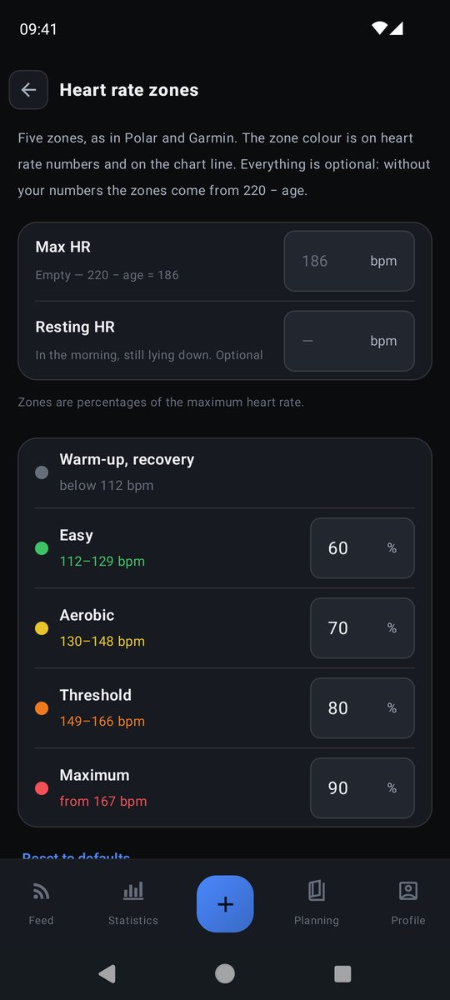</td>
  </tr>
  <tr>
    <td><b>Smart timer.</b> Every rest duration is yours to change.</td>
    <td><b>Capsule.</b> What stays in the collapsed capsule on the exercise screen — one row or two, any field in any position.</td>
    <td><b>Heart-rate zones.</b> Five zones as in Polar and Garmin, from your own maximum or 220 − age; a resting heart rate switches to Karvonen.</td>
  </tr>
  <tr>
    <td>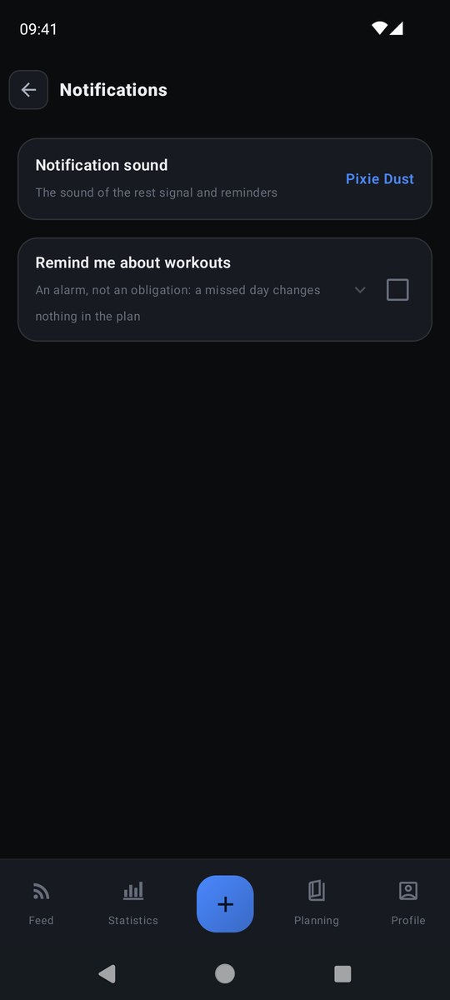</td>
    <td>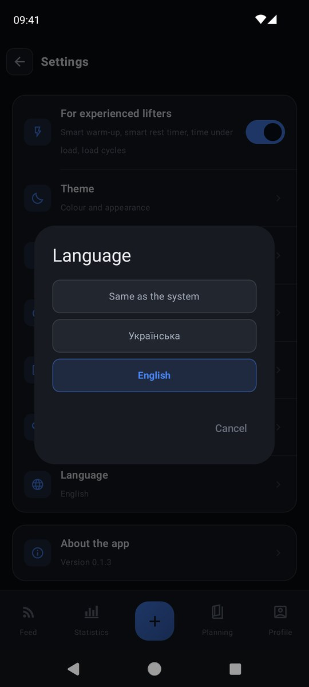</td>
    <td>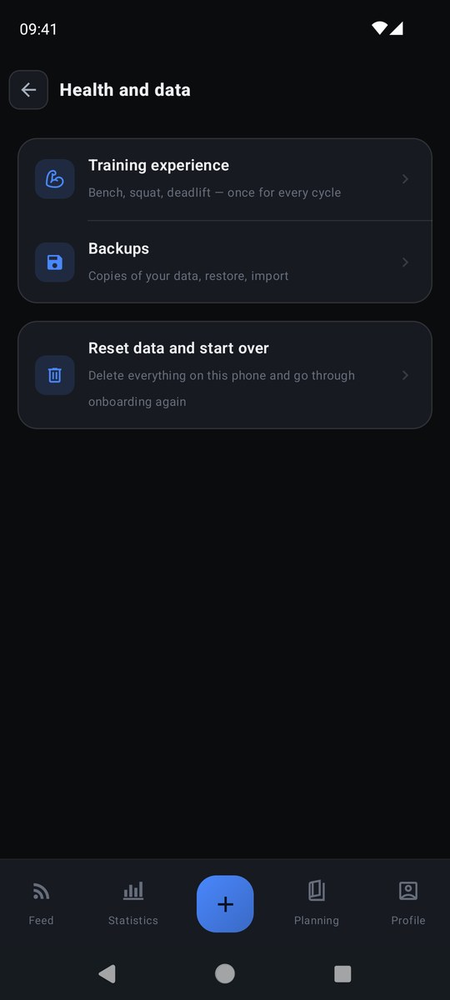</td>
  </tr>
  <tr>
    <td><b>Notifications.</b> The sound of the rest signal and reminders before your training days.</td>
    <td><b>Language.</b> English or Ukrainian — exercise names follow the language too.</td>
    <td><b>Health and data.</b> Training experience, backups, and a full reset.</td>
  </tr>
  <tr>
    <td>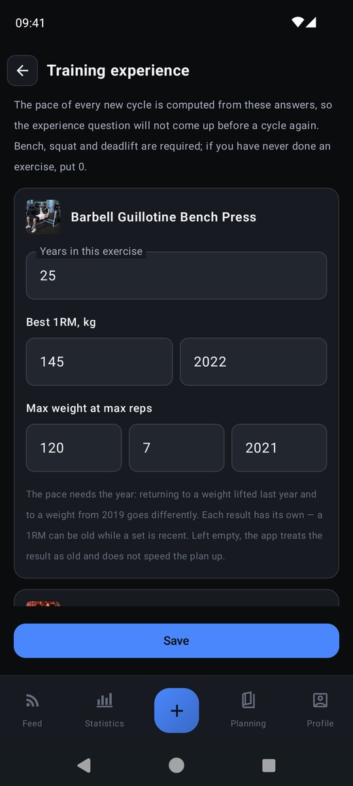</td>
    <td>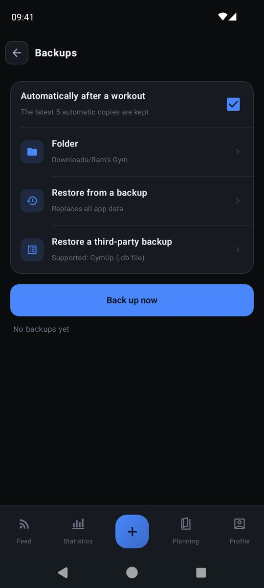</td>
    <td></td>
  </tr>
  <tr>
    <td><b>Training experience.</b> Years and records for the bench, squat and deadlift — answered once, used to set the pace of every cycle.</td>
    <td><b>Backups.</b> An automatic copy after every workout into Downloads (or a folder of your choice, Google Drive included), restore, and import from a GymUp backup.</td>
    <td></td>
  </tr>
</table>

---

## Install and update

1. Download the APK from the [latest release](https://github.com/Ramzesp2009/ramsgym-realses/releases/latest).
2. Open it on your phone and allow installing from this source when Android asks.
3. That’s it. The app checks for new versions once a day (or on demand: *Settings → Check for updates*) and installs them from this page; you get a notification when a new version is out.

Requires Android 10 or newer. Updates install only over a build signed with the same key, so always update from this page.

## Privacy

- Your training data is stored on your phone. There are no ads and no analytics trackers.
- The server (Supabase) holds only what the social part needs: your account, profile name and friend code, friendships, published workouts, likes and comments. Your profile photo is visible to friends only.
- Backups are files you own — in your Downloads folder or wherever you put them.

## License

[CC BY-NC 4.0](https://creativecommons.org/licenses/by-nc/4.0/) — free for non-commercial use with attribution.

Exercise data is based on [free-exercise-db](https://github.com/yuhonas/free-exercise-db) (Unlicense).

*Screenshots show demo data.*
